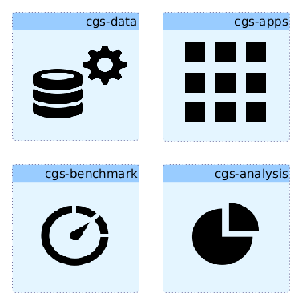

# The **CGS** project
The **CGS** project stands for Centralized genomics system. The goal of this project is to offer a big data infrastructure for genomics data, and in particular for variant information.

This project contains different modules that are related to each other but still can be used independently (up to some extent). Here are the modules available as github repositories:

- [**cgs-data**](https://github.com/jpoullet2000/cgs-data): this package defines how the data are built in this project, in particular how to upload variant information (VCF) in HBase, how to build a corresponding table in the metastore that will be accessible by tools like Hive, Impala, etc, allowing you to make SQL-like requests on your database. This also allows you to parametrize security on HBase (on column families, or even on HBASE cells).   
- [**cgs-apps**](https://github.com/jpoullet2000/cgs-apps): this package provides apps, for instance an apps allows you to access resources (or data) similar to the one you would access with Google Genomics. Those apps are developed as plugins for [Hue](http://gethue.com/).  
- [**cgs-analysis**](https://github.com/jpoullet2000/cgs-analysis): this package implements analysis tools that can be performed on data available in this project, for instance machine learning techniques distributed in the hadoop framework.  
- [**cgs-benchmarks**](https://github.com/jpoullet2000/cgs-benchmarks): this package presents different benchmark studies that have been performed using this system (CGS).

This project has been initiated within the BridgeIris project funded by [Innoviris](http://www.innoviris.be). 

Note that this project is at a very infant stage.
